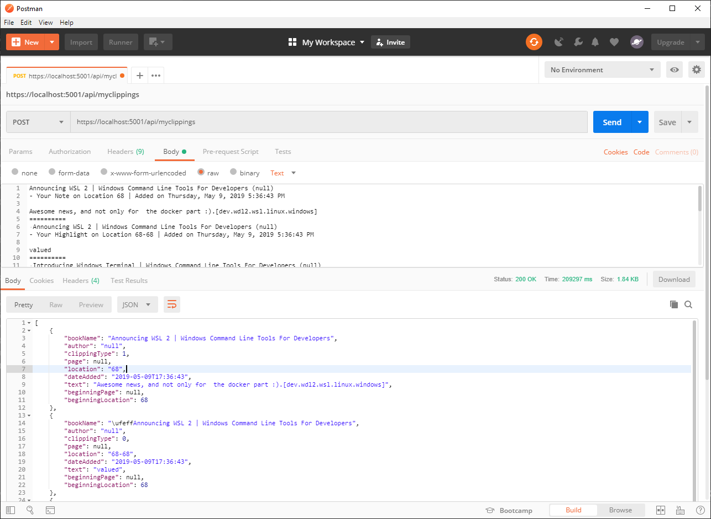
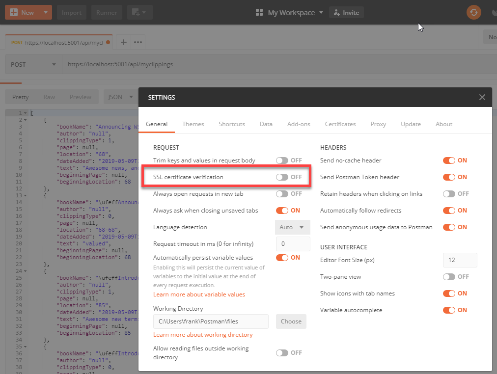

# MyClippings-Parser

[](https://dev.azure.com/cloud5mins/MyClippings-Parser/_build/latest?definitionId=19&branchName=master)

As simple as it could be, a .Net Core parser for the Amazon Kindle's "My Clippings.txt" file. The current version support the "Kindle Paperwhite".

Transforming the flat file into an Array JSON Objects.

So this

```
Announcing WSL 2 | Windows Command Line Tools For Developers (null)
- Your Note on Location 68 | Added on Thursday, May 9, 2019 5:36:43 PM

Awesome news, and not only for  the docker part :).[dev.wdl2.wsl.linux.windows]
==========
Announcing WSL 2 | Windows Command Line Tools For Developers (null)
- Your Highlight on Location 68-68 | Added on Thursday, May 9, 2019 5:36:43 PM

valued
==========
Introducing Windows Terminal | Windows Command Line Tools For Developers (null)
- Your Note on Location 85 | Added on Thursday, May 9, 2019 5:38:48 PM

Awesome new terminal with a  kitass look. Even more it's an open source project![dev.terminal.github]
==========
Introducing Windows Terminal | Windows Command Line Tools For Developers (null)
- Your Highlight on Location 85-85 | Added on Thursday, May 9, 2019 5:38:48 PM

Terminal
==========
Improve your Dockerfile, best practices (Chris Noring)
- Your Highlight on Location 120-120 | Added on Thursday, May 9, 2019 8:45:34 PM

There are many more best practices
==========
Improve your Dockerfile, best practices (Chris Noring)
- Your Note on Location 120 | Added on Thursday, May 9, 2019 8:47:25 PM

Nice quick post about some really easy best practices.It's so simple why would  you not  follow them.[dev.docker.bestpractices]
==========
```

Will become that:

```json
[
    {
        "bookName": "Announcing WSL 2 | Windows Command Line Tools For Developers",
        "author": "null",
        "clippingType": 1,
        "page": null,
        "location": "68",
        "dateAdded": "2019-05-09T17:36:43",
        "text": "Awesome news, and not only for  the docker part :).[dev.wdl2.wsl.linux.windows]",
        "beginningPage": null,
        "beginningLocation": 68
    },
    {
        "bookName": "\ufeffAnnouncing WSL 2 | Windows Command Line Tools For Developers",
        "author": "null",
        "clippingType": 0,
        "page": null,
        "location": "68-68",
        "dateAdded": "2019-05-09T17:36:43",
        "text": "valued",
        "beginningPage": null,
        "beginningLocation": 68
    },
    {
        "bookName": "\ufeffIntroducing Windows Terminal | Windows Command Line Tools For Developers",
        "author": "null",
        "clippingType": 1,
        "page": null,
        "location": "85",
        "dateAdded": "2019-05-09T17:38:48",
        "text": "Awesome new terminal with a  kitass look. Even more it's an open source project![dev.terminal.github]",
        "beginningPage": null,
        "beginningLocation": 85
    },
    {
        "bookName": "\ufeffIntroducing Windows Terminal | Windows Command Line Tools For Developers",
        "author": "null",
        "clippingType": 0,
        "page": null,
        "location": "85-85",
        "dateAdded": "2019-05-09T17:38:48",
        "text": "Terminal",
        "beginningPage": null,
        "beginningLocation": 85
    },
    {
        "bookName": "\ufeffImprove your Dockerfile, best practices",
        "author": "Chris Noring",
        "clippingType": 0,
        "page": null,
        "location": "120-120",
        "dateAdded": "2019-05-09T20:45:34",
        "text": "There are many more best practices",
        "beginningPage": null,
        "beginningLocation": 120
    },
    {
        "bookName": "\ufeffImprove your Dockerfile, best practices",
        "author": "Chris Noring",
        "clippingType": 1,
        "page": null,
        "location": "120",
        "dateAdded": "2019-05-09T20:47:25",
        "text": "Nice quick post about some really easy best practices.It's so simple why would  you not  follow them.[dev.docker.bestpractices]",
        "beginningPage": null,
        "beginningLocation": 120
    }
]
```


## How to use it

Simply do a HTTP Post passing the MyClippings.txt content in the body of you request.



> You will need to disable the `SLL certification verification` in Postman. To do this go in setting and disable it. 


## Learn more about MyClippings-Parser

- Code in GitHub: [Public Docker image](https://hub.docker.com/r/fboucher/myclippings-parser)
- Build and Test: [Public Azure DevOps](https://dev.azure.com/cloud5mins/MyClippings-Parser)
- Videos how it was build: [Public videos](https://github.com/FBoucher/stream-projects#myclippings-parser)
